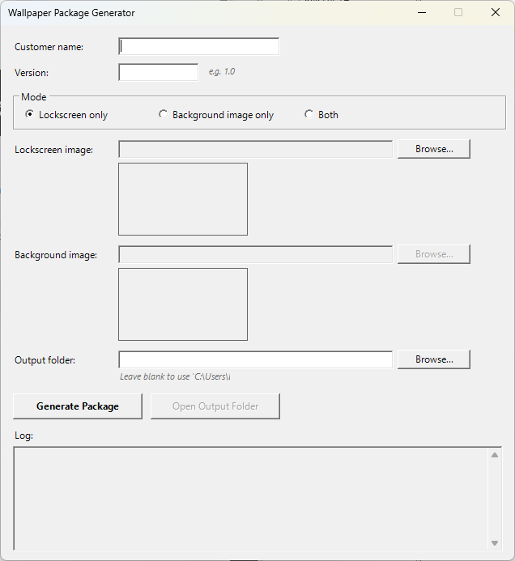

# Wallpaper Package Generator for Intune

Generate Intune Win32 app packages that deploy a lockscreen image, a desktop
background image, or both, enforced for every user on the device — with a
CLI and a GUI, for any number of customers, no internet access required.



## What it does

- Deploys the lockscreen image, the desktop background image, or both —
  your choice per package (`LockscreenOnly` / `BackgroundOnly` / `Both`).
- Applies to **every logged-in user** on the device via the Windows
  `Personalization` policy (`HKLM`), not a per-user setting — no user
  context needed at install time.
- **Multi-customer by design**: nothing is hardcoded. Customer name,
  version, mode and image files are all supplied per run, and the install
  location/registry path are namespaced under the customer's own name.
- **Versioned**: bump the version and re-run to publish an update: the
  generated detection script only reports "installed" for that exact
  version, so Intune knows to push the new one.
- Runs fully offline — no network access, no external dependencies beyond
  PowerShell itself.
- Two front-ends, one implementation: a command-line generator you can
  script, and a Windows Forms GUI that's a thin wrapper around it (no
  duplicated logic to keep in sync).

## How it works

Windows has two separate, both-documented registry mechanisms for enforcing
a lock screen/background image:

1. `HKLM\SOFTWARE\Policies\Microsoft\Windows\Personalization` — the
   ADMX-backed "Policy CSP – Personalization" node. Used by classic Group
   Policy and Intune's **Settings Catalog**.
2. `HKLM\SOFTWARE\Microsoft\Windows\CurrentVersion\PersonalizationCSP` — the
   older, standalone "Personalization CSP". Used by Intune's classic
   **Device restrictions → Personalization** profile type.

An earlier version of this tool wrote to both for maximum compatibility.
**Real-device testing on Windows 11 Pro found that writing to both at once
prevented the image from actually rendering** — writing to
`PersonalizationCSP` alone worked reliably. This tool now writes only to
`PersonalizationCSP`, and `Install.ps1` cleans up any stale values a
previous version left under the old `Policies` key on upgrade.

For the desktop background specifically, a registry value alone doesn't
repaint an already-open desktop session — `Install.ps1` also calls
`RUNDLL32.EXE USER32.DLL, UpdatePerUserSystemParameters 1, True` to force
Explorer to redraw immediately for any currently logged-on user, rather than
waiting for their next sign-in. The lock screen has no equivalent live-redraw
mechanism — it only re-renders on the next lock/sign-in event, which is
expected Windows behavior.

Because these are machine-wide (`HKLM`) settings, the install script runs as
SYSTEM (as Intune Win32 apps do by default) and the image applies to every
user who logs onto the device, without needing to run in a per-user context.

Setting `*ImageStatus = 1` also **enforces** the image — users won't be able
to change it from Settings. That's expected/standard for this deployment
method.

## Requirements

- **Windows 10/11 Pro, Enterprise, or Education.** Windows Home does not
  honor this policy at all, regardless of what's in the registry — see
  [Troubleshooting](#troubleshooting).
- PowerShell 5.1+ to run the generator/GUI, and to run on the target device.
- [Microsoft Win32 Content Prep Tool](https://github.com/microsoft/Microsoft-Win32-Content-Prep-Tool)
  (`IntuneWinAppUtil.exe`) to package the generated folder into `.intunewin`.
- An Intune/Endpoint Manager admin role to create the Win32 app.

## Project layout

```
IntuneWallpaperDeployment/
  New-WallpaperPackage.ps1      # CLI generator (shell, no GUI)
  New-WallpaperPackageGui.ps1   # GUI front-end for the same generator
  Templates/                     # generic script templates - edit these to
                                  # change behavior for ALL customers/packages
    Install.ps1
    Uninstall.ps1
    Detect.ps1.template
  Packages/                      # generator output (git-ignored), one folder
                                  # per customer:
    <CustomerName>/
      Package-v<Version>/
        Install.ps1
        Uninstall.ps1
        Detect.ps1
        config.json
        Images/
```

`Packages/` is where generated output lands and is excluded via
`.gitignore` — it's customer-specific data, not part of the tool.

## Quick start

Both tools run fully offline. They produce identical output — use whichever
you prefer.

### GUI

```powershell
.\New-WallpaperPackageGui.ps1
```

Enter the customer name and version, pick the mode with the radio buttons
(the image fields enable/disable to match), browse for the image file(s)
with a live thumbnail preview, then click **Generate Package**. The log
panel shows the generator's own output, and **Open Output Folder** jumps
straight to the result.

If `IntuneWinAppUtil.exe` is placed in this same folder (next to
`New-WallpaperPackageGui.ps1`), a **Create .intunewin** button appears
enabled once a package has been generated, and packages it for you (quiet
mode, so it won't hang waiting for a keypress) into that package's `Output\`
folder. If the tool isn't found there, the button stays greyed out and a
link to download it appears instead.

### CLI

**Interactive** — prompts for anything not supplied, re-prompts on invalid
input:

```powershell
.\New-WallpaperPackage.ps1
```

**Non-interactive** — for scripting or repeatable runs:

```powershell
# Lockscreen only
.\New-WallpaperPackage.ps1 -CustomerName Contoso -Version 1.0 -Mode LockscreenOnly `
    -LockscreenImagePath C:\Art\Contoso-Lockscreen.png

# Background image only
.\New-WallpaperPackage.ps1 -CustomerName Contoso -Version 1.0 -Mode BackgroundOnly `
    -DesktopImagePath C:\Art\Contoso-Desktop.png

# Both
.\New-WallpaperPackage.ps1 -CustomerName Contoso -Version 1.1 -Mode Both `
    -LockscreenImagePath C:\Art\lock.png -DesktopImagePath C:\Art\desktop.png
```

| Parameter | Required | Notes |
|---|---|---|
| `-CustomerName` | yes | Used in the `ProgramData` folder name and registry path. Characters invalid in a file/registry name are stripped automatically (with a warning). |
| `-Version` | yes | Dot-separated numbers, e.g. `1.0`, `2.1.3`. |
| `-Mode` | yes | `LockscreenOnly`, `BackgroundOnly` or `Both`. |
| `-LockscreenImagePath` | only if `-Mode LockscreenOnly` or `Both` | Path to the lockscreen image (png/jpg/jpeg/bmp/gif). |
| `-DesktopImagePath` | only if `-Mode BackgroundOnly` or `Both` | Path to the background/desktop image. |
| `-OutputRoot` | no | Where `Packages\` gets created. Defaults to the folder this script lives in. |
| `-Force` | no | Skip the overwrite confirmation if the package folder already exists. |

Supplying an image path the chosen mode doesn't need is ignored (with a
warning), not an error.

Both tools copy the image(s) into `Images\` under a standardized name
(`<CustomerName>-Lockscreen-v<Version>.<ext>` /
`<CustomerName>-Desktop-v<Version>.<ext>`), write `config.json`, drop in the
generic `Install.ps1`/`Uninstall.ps1`, and generate `Detect.ps1` from the
template with `CustomerName`/`Version` baked in.

### Choosing the mode later / per group

`Install.ps1` also accepts `-Mode` on its own command line, overriding
`config.json`. So you can generate one package and deploy it as separate
Intune apps with different Install commands, e.g. if some groups should
only get the lockscreen update:

```
powershell.exe -ExecutionPolicy Bypass -File Install.ps1 -Mode LockscreenOnly
powershell.exe -ExecutionPolicy Bypass -File Install.ps1 -Mode BackgroundOnly
powershell.exe -ExecutionPolicy Bypass -File Install.ps1 -Mode Both
```

## Deploying to Intune

### 1. Package as `.intunewin`

```powershell
IntuneWinAppUtil.exe -c "Packages\<CustomerName>\Package-v<Version>" -s "Install.ps1" -o "Packages\<CustomerName>\Package-v<Version>\Output"
```

(Both tools print this exact command, with paths filled in, when they
finish.)

### 2. Create the Win32 app in Intune

Intune admin center → **Apps** → **Windows** → **Add** → **Windows app
(Win32)**.

**Program**
| Field | Value |
|---|---|
| Install command | `powershell.exe -ExecutionPolicy Bypass -File Install.ps1` |
| Uninstall command | `powershell.exe -ExecutionPolicy Bypass -File Uninstall.ps1` |
| Install behavior | System |

**Requirements**
- Minimum OS: Windows 10 1607 or later (adjust per your fleet)

**Detection rules**
- Rule format: **Use a custom detection script**
- Script file: `Detect.ps1` from the generated package folder

**Assignments**
- Assign to the desired device/user groups as **Required**.

### 3. Publishing a new version

Run the generator again with the new version and image — e.g.:

```powershell
.\New-WallpaperPackage.ps1 -CustomerName Contoso -Version 1.1 -Mode LockscreenOnly `
    -LockscreenImagePath C:\Art\Contoso-Lockscreen-v1.1.png
```

This produces a new `Packages\Contoso\Package-v1.1\` folder with `Detect.ps1`
baked to expect `Version = "1.1"`. Then either:

- Package it and, in the existing Intune app's **App info**, upload the new
  `Install.intunewin` to replace the package content and update the
  detection script to the new `Detect.ps1`, or
- Publish it as a new app and use Intune's **Supersedence** feature to
  replace the old version on assigned devices (cleaner rollback path).

Because `Detect.ps1` checks `Version` against the tracking registry key
(`HKLM\SOFTWARE\<CustomerName>\WallpaperDeployment`), any device still on the
old version is evaluated as "not installed" and Intune reinstalls with the
new package.

## Notes

- **Per-customer isolation**: install location is
  `%ProgramData%\<CustomerName>\WallpaperDeployment\`, and tracking state is
  `HKLM\SOFTWARE\<CustomerName>\WallpaperDeployment`. If that
  `ProgramData\<CustomerName>` folder already exists (e.g. from another app
  for the same customer), that's fine — creation uses `-Force` and only adds
  a `WallpaperDeployment` subfolder.
- Install/uninstall logs are written next to the cached images as
  `Install.log` / `Uninstall.log` for troubleshooting via Intune's app
  install status / IME logs. Every registry value the scripts set or remove
  is logged with its full path, e.g. `[Registry set] HKLM:\...\PersonalizationCSP\LockScreenImageStatus = 1`,
  so you can see exactly what changed without separately inspecting the
  registry.
- To change install/uninstall/detection *behavior* for every future package
  (all customers), edit the files under `Templates\` — don't hand-edit a
  generated package folder, since the next regeneration will overwrite it.

## Troubleshooting

**Lockscreen/background still shows the Windows default after install
succeeds and the registry values look correct.**

1. Check that `HKLM\SOFTWARE\Policies\Microsoft\Windows\Personalization`
   (the old, no-longer-used key) is **not** also populated. If a device was
   deployed with a version of this tool from before the switch to
   `PersonalizationCSP`-only (see [How it works](#how-it-works)), and hasn't
   been re-installed since, it may still have stale values there — having
   both keys populated at once was the confirmed cause of the image failing
   to render on Windows 11 Pro in real testing. Redeploying with the current
   version cleans this up automatically.
2. Check Windows activation: **Settings → System → Activation**. An
   unactivated Windows installation blocks personalization even when the
   registry values are set correctly. Activate and retry.
3. For the desktop background, confirm the device actually received the
   `RUNDLL32.EXE USER32.DLL, UpdatePerUserSystemParameters 1, True` refresh
   call — check `Install.log` for "Refreshed desktop background for
   logged-on users". Without it, a currently-open desktop session won't
   repaint until next sign-in.
4. For the lock screen, verify by actually locking the screen (**Win+L**),
   not just by looking at the **Settings → Personalization → Lock screen**
   preview, which can be stale. There's no live-refresh equivalent for the
   lock screen — it only re-renders on the next lock/sign-in event.
5. If the background type control in that Settings page isn't greyed out
   (forced to "Picture"), Windows isn't recognizing the policy yet — confirm
   you're on Pro/Enterprise/Education and that the values are under `HKLM`
   (not `HKCU`).
6. On an Intune-managed device, check whether another Device
   Configuration/Settings Catalog/Security Baseline profile also touches
   Personalization/Lock screen — a competing MDM-delivered policy can
   re-assert its own value over what this tool wrote on the next sync. If
   you find one, resolve it at the Intune policy level (remove the
   conflicting profile or set its Personalization setting to "Not
   configured") rather than fighting it locally.
7. Run [`docs/Diagnose-LockScreen.ps1`](docs/Diagnose-LockScreen.ps1)
   (elevated, read-only) on the affected machine — it dumps both registry
   locations' current values, the image file's validity/ACL, MDM enrollment
   state, any competing MDM-delivered Personalization policy, and the lock
   screen render cache, in one pass.

**GUI shows a `ValidateSet`/parameter error when generating.**

Make sure `New-WallpaperPackageGui.ps1` and `New-WallpaperPackage.ps1` are
from the same version of this repo — the GUI calls the CLI script by name
and passes parameters by name (hashtable splatting), so mismatched versions
of the two files can disagree on parameter names.
